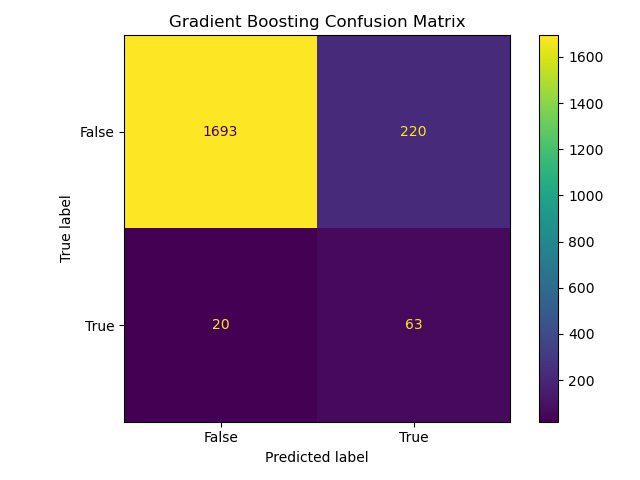
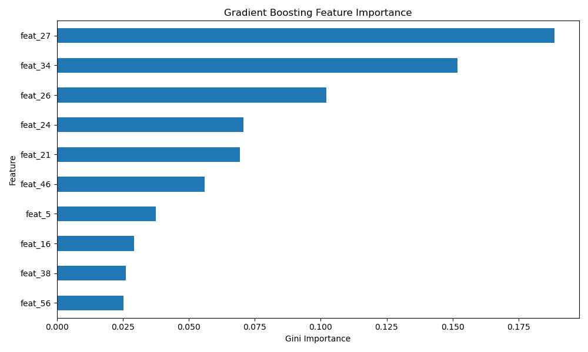

# 🇵🇱 Bankruptcy Prediction for Polish Companies

## 📌 Project Overview
This project aims to predict bankruptcy for Polish companies using historical financial data. By analyzing financial ratios extracted from economic reports, we build machine learning models to classify companies as either "Bankrupt" or "Healthy."

Given the highly imbalanced nature of the dataset (bankruptcy is a rare event), this project emphasizes advanced **resampling techniques** and **ensemble learning** strategies to improve risk detection.

---

## 📂 The Dataset
The data is sourced from the **Polish Companies Bankruptcy Data**, containing financial information over a 5-year period.

* **Format:** Compressed JSON (`.json.gz`).
* **Input Features:** 64 anonymized financial ratios (`feat_1` to `feat_64`), representing liquidity, profitability, leverage, and turnover.
* **Target Variable:** `bankrupt` (Binary: `True` for bankrupt, `False` for healthy).

---

## ⚙️ Methodology & Workflow

### 1. Exploratory Data Analysis (EDA)
* Loaded and decompressed JSON data into a Pandas DataFrame.
* Visualized the class imbalance (Bankrupt vs. Non-Bankrupt).
* Analyzed feature distributions using boxplots to identify outliers.
* Checked for multicollinearity among financial ratios using Heatmaps.

### 2. Data Preprocessing
* **Imputation:** Handled missing values using `SimpleImputer` (Median strategy).
* **Train-Test Split:** Split data into training (80%) and testing (20%) sets.
* **Resampling (Crucial Step):** To address the severe class imbalance, we experimented with:
    * `RandomUnderSampler`: Reducing the majority class.
    * `RandomOverSampler`: Duplicating the minority class.
    * *Note: Resampling was applied only to the training set to prevent data leakage.*

### 3. Model Development
We trained and evaluated three primary classifiers:
1.  **Decision Tree Classifier:** Used as a baseline model.
2.  **Random Forest Classifier:** An ensemble bagging method to reduce variance.
3.  **Gradient Boosting Classifier:** An ensemble boosting method to reduce bias and improve sensitivity.

---

## 📊 Results & Performance Evaluation

| Model | Accuracy | Recall (Bankruptcy Capture) | Key Observation |
| :--- | :--- | :--- | :--- |
| **Decision Tree** | ~94% | 35% | High variance; struggled to generalize on the minority class. |
| **Random Forest** | **96%** | 13% | Optimized for accuracy but missed most bankruptcy cases ("Safe but Blind"). |
| **Gradient Boosting** | 88% | **76%** | **Best Risk Detector.** Sacrificed some accuracy to capture the majority of bankruptcies. |

### Visualizations

#### 1. Exploratory Analysis
The dataset exhibits a severe class imbalance, which motivated our use of resampling techniques.


#### 2. Model Performance (Confusion Matrices)
Comparing the models shows how Gradient Boosting (right) captures significantly more True Positives (Bankruptcies) than the other models.

| Decision Tree | Random Forest | Gradient Boosting |
| :---: | :---: | :---: |
|  |  |  |

---

## 🔑 Key Predictive Features

Our analysis identified specific financial ratios that are strong indicators of bankruptcy. Based on the feature importance plots and the data dictionary, the following features consistently emerged as critical drivers of risk:

* **`feat_27` (Profit on Operating Activities / Financial Expenses):**
    * *Significance:* This was the **#1 predictor** in our best-performing model (Gradient Boosting). It essentially measures a company's ability to cover its interest payments with operating income (Interest Coverage Ratio). A low ratio indicates financial distress and high bankruptcy risk.
* **`feat_34` (Operating Expenses / Total Liabilities):**
    * *Significance:* A measure of operational efficiency relative to debt. High operating expenses combined with high liabilities increases the burden on the company, raising the probability of default.
* **`feat_26` ((Net Profit + Depreciation) / Total Liabilities):**
    * *Significance:* This ratio proxies cash flow available to service total debt. It was the top feature for the Decision Tree model, reinforcing the importance of liquidity and debt service capacity.
* **`feat_24` (Gross Profit (in 3 years) / Total Assets):**
    * *Significance:* Indicates long-term profitability trends relative to asset size.



**Business Insight:**
The models are not just memorizing data; they are prioritizing **debt service capacity** and **operational efficiency**. Companies that generate sufficient operating profit to cover financial costs (`feat_27`) and manage their liabilities effectively (`feat_34`, `feat_26`) are classified as "Healthy," while those that fail these metrics are flagged as "Bankrupt."

---

## 🛠 Tools & Libraries Used
* **Python** (3.x)
* **Pandas & NumPy** (Data Manipulation)
* **Matplotlib & Seaborn** (Data Visualization)
* **Scikit-Learn** (Modeling & Metrics)
* **Imbalanced-Learn** (Resampling Techniques)

---

## 🚀 How to Run the Project
1.  Clone the repository:
    ```bash
    git clone [https://github.com/yourusername/polish-bankruptcy-prediction.git](https://github.com/yourusername/polish-bankruptcy-prediction.git)
    ```
2.  Install dependencies:
    ```bash
    pip install pandas numpy scikit-learn imbalanced-learn matplotlib seaborn
    ```
3.  Run the Jupyter Notebook:
    ```bash
    jupyter notebook "Predicting Bankruptcy In Poland.ipynb"
    ```

---

## 🔮 Future Improvements
* **Threshold Tuning:** Adjusting the classification probability threshold to improve Precision without hurting Recall.
* **Feature Engineering:** Creating new financial ratios based on domain knowledge.
* **XGBoost / LightGBM:** Testing more advanced boosting algorithms for potentially better performance.

---

### 👤 Author
[Dixon Godwin]